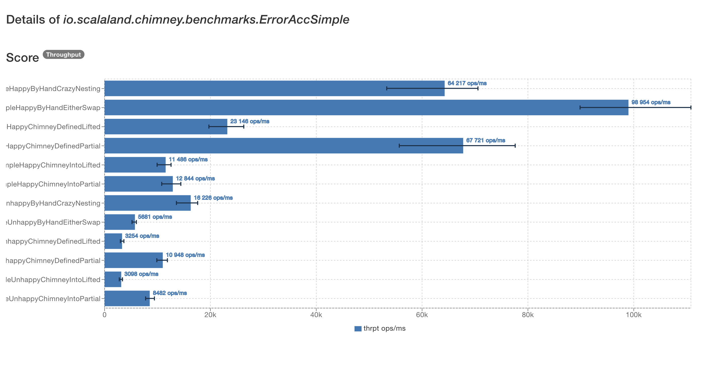

// 45 minutes
:revealjs_totalTime: 2700

= Unveiling the{nbsp}Magic

**Chimney's Internals, Macros & Scala 3 Transition**

Mateusz Kubuszok

== About me

[%step]
* breaking things in Scala for 8+ years
* breaking things for money for 10 years
* breaking things for fun for 18(?) years
* a little bit of open source - including co-authoring Chimney for 6 years now
* blog at https://kubuszok.com[Kubuszok.com]
* niche https://leanpub.com/jvm-scala-book[Things you need to know about JVM (that matter in Scala)] ebook

[NOTE.speaker]
--
Every presentation should start with some excuse, why you even are here
--

== Agenda

[%step]
* what are Chimney's features
* what kind of code are we generating
* goals for the migration to Scala 2+3
* research and the current state

[NOTE.speaker]
--
I'll skip explaining why Chimney exists because previous presentation already dscussed the use cases.

I'll list features because it will help understand what we are generating and what we are supporting.
--

== Chimney's features

=== ``case class`` conversions

[source, scala]
--
import io.scalaland.chimney.dsl.* // assume this from now on
--

[source, scala]
--
case class Foo(a: Int, b: Double)
case class Bar(a: Int, b: Double) // same fields

Foo(1, 2.0).transformInto[Bar] // Bar(1, 2.0)
--

[NOTE.speaker]
--
If every field in ``Bar`` has a corresponding field in ``Foo`` and fields don't have to be converted, transformation doesn't require any configuration.
--

=== !

[source, scala]
--
case class Foo(a: Int, b: Double)
case class Bar(a: Int, c: Double) // c instead of b

Foo(1, 2.0).into[Bar]
  .withFieldRenamed(_.b, _.c)
  .transform // Bar(1, 2.0)
--

[NOTE.speaker]
--
If we don't want to provide value because field can take value from another field we can use rename.
--

=== !

[source, scala]
--
case class Foo(a: Int, b: Double)
case class Bar(a: Int, b: Double, c: String) // extra field

Foo(1, 2.0).into[Bar]
  .withFieldConst(_.c, "test")
  .transform // Bar(1, 2.0, "test")
--

[source, scala]
--
case class Foo(a: Int, b: Double)
case class Bar(a: Int, b: Double, c: String) // extra field

Foo(1, 2.0).into[Bar]
  .withFieldComputed(_.c, foo => foo.toString)
  .transform // Bar(1, 2.0, "Foo(1, 2.0)")
--

[NOTE.speaker]
--
If we have to fill an new field, we can use provide constant or compute the value.
--

=== !

[source, scala]
--
case class Foo(a: Int, b: Double)
case class Bar(a: Int, b: Double, c: String = "c") // ditto

Foo(1, 2.0).into[Bar]
  .enableDefaultValues
  .transform // Bar(1, 2.0, "c")
--

[source, scala]
--
case class Foo(a: Int, b: Double)
case class Bar(a: Int, b: Double, c: Option[String])//ditto

Foo(1, 2.0).into[Bar]
  .enableOptionDefaultsToNone
  .transform // Bar(1, 2.0, None)
--

[NOTE.speaker]
--
Or we can use some defaults if no other way is available but some default is accessible.
--

=== Tuples conversions

[source, scala]
--
case class Foo(a: Int, b: Double)

Foo(1, 2.0).transformInto[(Int, Double)] // (1, 2.0, None)
(1, 2.0).transformInto[Foo] // Foo(1, 2.0, None)
--

[NOTE.speaker]
--
If either side of a transformation is a tuple we match fields by their positions instead of names.
--

=== Java Beans conversions

[source, scala]
--
case class Foo(a: Int, b: Double)
class Bar private (
  @BeanProperty var a: Int,
  @BeanProperty var b: Double
) {
  def this() = this(0, 0.0)
}

Foo(1, 2.0).into[Bar].enableBeanSetters.transform

import scala.util.chaining.*
new Bar().pipe(_.setA(1)).pipe(_.setB(2.0))
  .into[Foo].enableBeanGetters.transform
--

[NOTE.speaker]
--
Instead of a case class we might use a Java Bean as well.
--

=== !

[source, scala]
--
class Foo {
  def a: Int = 1
}

case class Bar(a: Int)

Foo(1).into[Bar].enableMethodAccessors.transform
--

[NOTE.speaker]
--
By default only ``case class`` fields are takein into consideration.
--

=== ``sealed`` hierarches conversions

[source, scala]
--
sealed trait Foo
object Foo {
  case object A extends Foo
  case class B(b: Int) extends Foo
}

sealed trait Bar // same subtypes
object Bar {
  case object A extends Foo
  case class B(b: Int) extends Bar
}

(Foo.A : Foo).transformInto[Bar] // Bar.A
(Foo.B(1) : Foo).transformInto[Bar] // Bar.B(1)
--

=== !

[source, scala]
--
sealed trait Foo
object Foo {
  case object A extends Foo
  case class B(b: Int) extends Foo
  case class C(c: Double) extends Foo
}
sealed trait Bar // missing Bar.C
object Bar {
  case object A extends Foo
  case class B(b: Int) extends Bar
}
(Foo.C(2.0) : Foo).into[Bar].withCoproductInstance[Foo.C] {
    case Foo.C(c) => Bar.B(c.toInt)
  }.transform // Bar.B(2)
--

[NOTE.speaker]
--
There is an interesting duality between products and coproducts: products require that all output fields have sources, and coproducts require that all input types have targets.
--

=== ``AnyVal`` conversions

[source, scala]
--
case class Foo(val value: Int) extends AnyVal
case class Bar(val value: Int) extends AnyVal

Foo(1).transformInto[Bar] // Bar(1)
Foo(1).transformInto[Int] // 1
1.transformInto[Bar] // Bar(1)
--

=== Implicit ``Transformer``

[source, scala]
--
class SomeType(val x: Int)
class AnotherType(val y: Int)

case class Foo(a: SomeType, b: Int)
case class Bar(a: AnotherType, b: Int)

foo.transformInto[Bar] // error: how to convert foo.a?
--

[%step]
[source, scala]
--
import io.scalaland.chimney.Transformer

implicit val someTypeToAnotherType:
   Transformer[SomeType, AnotherType] =
  st => new AnotherType(y = st.x) // single abstract method

foo.transformInto[Bar]//uses someTypeToAnotherType for foo.a
--

[NOTE.speaker]
--
This shows the true power of Chimney as transformetions can be generated recursively and then we only have to manually plug-in the types which cannot be figured out.
--

=== Implicit ``TransformerConfiguration``

[source, scala]
--
implicit val cfg = TransformerConfiguration.default
  .enableDefaultValues
  .enableOptionDefaultsToNone
  .enableBeanGetters
  .enableBeanSetters

// now .into.transform and .transformInto use above flags
--

=== Partial Transformers

[source, scala]
--
case class Foo(a: Option[Int])
case class Bar(a: Int)

Foo(None).transformInto[Bar] // cannot handle None!
--

[%step]
[source, scala]
--
val result = Foo(None).transformIntoPartial[Bar]
result.asEither // Left(...)
result.asErrorPathMessages
  // Iterable("a" -> ErrorMessage.EmptyValue)
--

=== !

[source, scala]
--
implicit val intToString:
    Transformer[Int, String] =
  int => int.toString

implicit val stringToInt:
    PartialTransformer[String, Int] =
  PartialTransformer { str =>
    partial.Result.fromCatching(str.toInt)
  }

case class Foo(a: Option[Int], b: String)
case class Bar(a: String, b: Int)

Foo(None, "test").transformIntoPartial[Bar]
--

[NOTE.speaker]
--
Partial has all the properties of toral transformers and more.
--

=== !

[source, scala]
--
// from is case class
from.intoPartial[To]
  // total operations
  .withFieldRenamed(_.a, _.b)
  .withFieldConst(_.c, value)
  .withFieldComputed(_.d, from => ...)
  // partial operations
  .withFieldComputedPartial(_.e, from => ...)
  .transform
--

[source, scala]
--
// from is sealed hierarchy
from.intoPartial[To]
  // total operations
  .withCoproductInstance[To.Subtype](...)
  // partial operations
  .withCoproductInstancePartial[To.Subtype](...)
  .transform
--

=== !

[source, scala]
--
implicit val totalInt2String:
    Transformer[String, Int] =
  str => scala.util.Try(str.toInt).getOrElse(0)

implicit val stringToInt:
    PartialTransformer[String, Int] =
  PartialTransformer { str =>
    partial.Result.fromCatching(str.toInt)
  }

case class Foo(a: String)
case class Bar(a: Int)

Foo(1).transformIntoPartial[Bar] // error: ambiguity!
--

[%step]
[source, scala]
--
implicit val cfg = TransformerConfiguration.default
 .enableImplicitConflictResolution(PreferTotalTransformer)
 /* or
 .enableImplicitConflictResolution(PreferPartialTransformer)
 */
--

=== !

[source, scala]
--
implicit val stringToInt:
    PartialTransformer[String, Int] =
  PartialTransformer.fromFunction(_.toInt)

case class Foo(a: String, foo: Foo2)
case class Foo2(b: String)

case class Bar(a: Int, foo: Bar2)
case class Bar2(b: Int)
--

[%step]
[source, scala]
--
Foo("a", Foo2("b"))
  .transformIntoPartial[Bar]
  .asErrorPathMessageStrings
// List("a" -> "For input string: \"a\"",
//      "foo.b" -> "For input string: \"b"\")
--

[%step]
[source, scala]
--
Foo("a", Foo2("b"))
  .transformIntoPartial[Bar](failFast = true)
  .asErrorPathMessageStrings
// List("a" -> "For input string: \"a\"")
--

=== Patchers

[source, scala]
--
case class Foo(a: Int, b: String, c: Double)
case class Patch(c: Double)

Foo(1, "2", 3.0).patchUsing(Patch(4.0)) // Foo(1, "2", 4.0)
--

[NOTE.speaker]
--
Patchers are currently shallow, they don't update things in-depth, and only support ``case class``es.
--

== Generated code

=== Are we generating ``new Transformer``s?

[source, scala]
--
case class Foo(a: Int, b: String)
case class Bar(a: Int, b: String)

Foo(1, "b").transformInto[Bar]
--

Do we generate:

[source, scala]
--
new Transformer {
  def transform(foo: Foo): Bar = Bar(
    Transformer.identity[Int].transform(foo.a),
    Transformer.identity[String].transform(foo.b)
  )
}.transform(Foo(1, "b"))
--

?

[NOTE.speaker]
--
Answer: in the old times when it was a Shapeless project, we did, but for many years we don't.
--

=== !

[source, scala]
--
case class Foo(a: Int, b: String)
case class Bar(a: Int, b: String)

Foo(1, "b").transformInto[Bar]
--

[%step]
[source, scala]
--
val foo = Foo(1, "b")
new Bar(foo.a, foo.b)
--

[NOTE.speaker]
--
Actually, what Chimney generates is the expression with the target type. Everything is inlined from the start.
--

=== !

[source, scala]
--
implicit val totalInt2String:
    Transformer[String, Int] =
  str => scala.util.Try(str.toInt).getOrElse(0)

case class Foo1(a: Int, b: String, foo: Foo2)
case class Foo2(f: String)

case class Bar1(a: Int, b: String, foo: Bar2)
case class Bar2(f: Int)

Foo1(1, "b", Foo2("9")).transformInto[Bar1]
--

[%step]
[source, scala]
--
val foo1 = Foo1(1, "b", Foo2("9"))
new Bar1(
  foo1.a,
  foo1.b,
  new Bar2(totalInt2String.transform(foo1.foo.f))
)
--

=== Calling ``unapply``?

[source, scala]
--
implicit val totalInt2String: Transformer[String, Int] = ...

sealed trait Foo3
object Foo3 {
  case object A extends Foo3
  case class B(b: String) extends Foo3 }

sealed trait Bar3
object Bar3 {
  case object A extends Bar3
  case class B(b: Int) extends Bar3 }

(Foo3.B("9"): Foo3).transformInto[Bar3]
--

[%step]
[source, scala]
--
val foo1 = (Foo3.B("9"): Foo3)
foo3 match {
  case (_: Foo3.A.type) => Bar3.A
  case (b @ (_: Foo3.B)) =>
    new Bar3.B(totalInt2String.transform(b.b))
}
--

[NOTE.speaker]
--
Here ``foo1`` is name generated by compiler to avoid clashes, I also added new lines and indentations and remobed full qualifies names, but that's basically expr that was generated.
--

=== What happens when we customize ``Transformer``?

=== !

[source, scala]
--
case class Foo4(a: Int)
case class Bar4(a: Int, b: String, c: Double)
Foo4(1).into[Bar4]
  .withFieldConst(_.b, "test")
  .withFieldComputed(_.c, _.a.toDouble)
  .transform
--

[%step]
[source, scala]
--
val ti$1 = Foo4(1).into[Bar4] // <- stores runtime data
.__refineTransformerDefinition(td =>
td.__addOverride("test".asInstanceOf[scala.Any])
  .__refineConfig[FieldConst["b",Empty]]
)
.__refineTransformerDefinition(td =>
td.__addOverride((_.a.toDouble).asInstanceOf[scala.Any]
  .__refineConfig[FieldComputed["c",FieldConst["b",Empty]]])
)
--

[%step]
[source, scala]
--
new Transformer[Foo4, Bar4] {
def transform(foo4$1: Foo4): Bar4 = new Bar4(
 foo4$1.a,
 ti$1.td.runtimeData(1).asInstanceOf[String],
 ti$1.td.runtimeData(0).asInstanceOf[Foo4 => Double](foo4$1)
)
}.transform(ti$1.source)
--

[NOTE.speaker]
--
Users don't have to call ``.transform`` immediatelly, they can build it in steps so we need to store input, constants and functions in some runtime representation.
--

=== What when we need recursion?

[source, scala]
--
case class FooR(a: Int, b: Option[FooR])
case class BarR(a: Int, b: Option[BarR])

FooR(1, Some(FooR(2, None))).transformInto[BarR] // error!
--

[%step]
[source, scala]
--
implicit def fooBarR: Transformer[FooR, BarR] =
  fooR => fooR.transformInto[Bar] // also error!

FooR(1, Some(FooR(2, None))).transformInto[BarR]
--

[%step]
[source, scala]
--
implicit def fooBarR: Transformer[FooR, BarR] =
  Transformer.derive[FooR, BarR]

FooR(1, Some(FooR(2, None))).transformInto[BarR]
--

[%step]
[source, scala]
--
new BarR(foor.a, foor.b.map(b => fooBarR.transform(b)))
--

[NOTE.speaker]
--
We cannot do inline derivation bacause it cannot handle recursion, we also cannot do transformInto within implicit because it would call itself.
--

=== Partial Transformers combinators?

=== !

[source, scala]
--
case class Foo5_0(a: Int, b: Int, c: Int)
case class Bar5(a: Int, b: Int, c: Int)

implicit val stringToInt: PartialTransformer[String, Int] =
  PartialTransformer.fromFunction[String, Int](_.toInt)

Foo5_0(1, 2, 3).transformIntoPartial[Bar5]
--

[%step]
[source, scala]
--
val foo5_0 = Foo5_0(1, 2, 3)
partial.Result.Value(new Bar5(foo5_0.a, foo5_0.b, foo5_0.c))
--

=== !

[source, scala]
--
case class Foo5_1(a: String, b: Int, c: Int)
case class Bar5(a: Int, b: Int, c: Int)

implicit val stringToInt: PartialTransformer[String, Int] =
  PartialTransformer.fromFunction[String, Int](_.toInt)

Foo5_1("1", 2, 3).transformIntoPartial[Bar5]
--

[%step]
[source, scala]
--
val foo5_1 = Foo5_1("1", 2, 3)
stringToInt.transform(foo5_1.a)
  .prependErrorPath(partial.PathElement.Accessor("a"))
  .map((a: Int) => new Bar5(a, foo5_1.b, foo5_1.c)
--

=== !

[source, scala]
--
case class Foo5_2(a: String, b: String, c: Int)
case class Bar5(a: Int, b: Int, c: Int)

implicit val stringToInt: PartialTransformer[String, Int] =
  PartialTransformer.fromFunction[String, Int](_.toInt)

Foo5_2("1", "2", 3).transformIntoPartial[Bar5]
--

[%step]
[source, scala]
--
val foo5_2 = Foo5_2("1", "2", 3)
partial.Result.map2[Int, Int, Bar5](
  stringToInt.transform(foo5_2.a)
    .prependErrorPath(partial.PathElement.Accessor("a")),
  stringToInt.transform(foo5_2.b)
    .prependErrorPath(partial.PathElement.Accessor("b")),
  {
    case (a: Int), (b : Int) => new Bar5(a, b, foo5_2.c)
  },
  failfast
)
--

=== !

[source, scala]
--
case class Foo5_3(a: String, b: String, c: String)
case class Bar5(a: Int, b: Int, c: Int)

implicit val stringToInt: PartialTransformer[String, Int] =
  PartialTransformer.fromFunction[String, Int](_.toInt)

Foo5_3("1", "2", "3").transformIntoPartial[Bar5]
--

[%step]
[source, scala]
--
val foo5_3 = Foo5_3("1", "2", "3")
final def rd_a: partial.Result[Int] =
  stringToInt.transform(foo5_3.a)
    .prependErrorPath(partial.PathElement.Accessor("a"))
final def rd_b: partial.Result[Int] =
  stringToInt.transform(foo5_3.b)
     .prependErrorPath(partial.PathElement.Accessor("b"))
final def rd_c: partial.Result[Int] =
  stringToInt.transform(foo5_3.c)
    .prependErrorPath(partial.PathElement.Accessor("c"))
if (failfast)
  for {
    rvff_a <- rd_a
    rvff_b <- rd_b
    rvff_b <- rd_c
  } yield new Bar5(rvff_a, rvff_b, rvff_c)
else {
  var allerrors: partial.Result.Errors = null;
  final val rv_a = rd_a
  allerrors = partial.Result.Errors
    .__mergeResultNullable(allerrors, rv_a)
  final val rv_b = rd_b
  allerrors = partial.Result.Errors
    .__mergeResultNullable(allerrors, rv_b)
  final val rv_c = rd_c
  allerrors = partial.Result.Errors
    .__mergeResultNullable(allerrors, rv_c)
  if (allerrors == null)
    partial.Result.Value(
      new Bar5(
        rv_a.asInstanceOf[partial.Result.Value[Int]].value,
        rv_b.asInstanceOf[partial.Result.Value[Int]].value,
        rv_c.asInstanceOf[partial.Result.Value[Int]].value
      )
    )
  else
    allerrors
}
--

=== !

== Migration's goals (Chimney 0.8.0)

[%step]
* source compatibility
* (excluding deprecated features which are removed)
* sharing as much code generation logic between Scala 2 and Scala 3 as possible

=== ``enableUnsafeOption`` deprecation

[source, scala]
--
case class Foo(a: Option[Int])
case class Bar(b: Int)

// this won't compile
Foo(None).transformInto[Bar]

// this is deprecated
Foo(None).into[Bar].enableUnsafeOption.transform
--

[%step]
[source, scala]
--
Foo(None).intoPartial[Bar].asOption // Option[Bar]

// alternatively, on your own risk!
// implicit def unsafeOption[A, B](
//   implicit t: Transform[A, B]
// ): Transformer[Option[A], B] = ...
// Foo(None).transformInto[Bar]
--

=== ``TransformerF`` deprecation

[source, scala]
--
case class Foo(a: Option[Int])
case class Bar(b: Int)

// deprecated
Foo(None).transformIntoF[Option, Bar]
Foo(None).transformIntoF[Either[String, +*], Bar]
--

[%step]
[source, scala]
--
Foo(None).transformIntoPartial[Bar].asOption
Foo(None).transformIntoPartial[Bar].asEither
--

== Research for Scala 3 migration

=== Are differences in macros the issue?

[%step]
[source, scala]
--
trait Common {
  type Type[A]
  type Expr[A]
  // methods working with Type[A] and Expr[A]
}
--

[%step]
[source, scala]
--
class Scala2Macro(val c: blackbox.Context) extends Common {
  final Type[A] = c.Type @@ A // tagged type
  final Expr[A] = c.Expr[A]
  // platform-specific methods implementations
}
--

[%step]
[source, scala]
--
class Scala3Macro(using q: quoted.Quotes) extends Common {
  final Type[A] = quoted.Type[A]
  final Expr[A] = quoted.Expr[A]
  // platform-specific methods implementations
}
--

=== So what is the actual issue?

[%step]
[source, scala]
--
  def mkTransformerBodyTree(
      To: Type,
      targets: Seq[Target],
      bodyTreeArgs: Seq[DerivedTree],
      derivationTarget: DerivationTarget
  )(
      mkTargetValueTree: Seq[Tree] => Tree
  ): DerivedTree = {
    assert(targets.size == bodyTreeArgs.size, "targets arity must correspond to the argument trees arity")

    derivationTarget match {
      case DerivationTarget.TotalTransformer =>
        assertOrAbort(
          bodyTreeArgs.forall(_.isTotalTarget),
          "All derived body trees arguments must be total in Total target derivation!"
        )
        DerivedTree.fromTotalTree(mkTargetValueTree(bodyTreeArgs.map(_.tree)))

      case pt: DerivationTarget.PartialTransformer =>
        assertOrAbort(
          bodyTreeArgs.forall(a => a.isTotalTarget || a.isPartialTarget),
          "Only Total and Partial body tree arguments are supported in Partial target derivation!"
        )

        val (totalArgs, partialArgs) = (targets zip bodyTreeArgs).partition(_._2.isTotalTarget)

        if (partialArgs.isEmpty) {
          DerivedTree.fromTotalTree(mkTargetValueTree(bodyTreeArgs.map(_.tree)))
        } else if (partialArgs.sizeIs == 1) {
          val (target, bodyTree) = partialArgs.head
          val fn = freshTermName(target.name)
          val totalArgsMap = totalArgs.map { case (target, bt) => target -> bt.tree }.toMap
          val argsMap = totalArgsMap + (target -> q"$fn")
          val updatedArgs = targets.map(argsMap)

          DerivedTree(q"${bodyTree.tree}.map { ($fn: ${target.tpe}) => ${mkTargetValueTree(updatedArgs)} }", pt)
        } else if (partialArgs.sizeIs == 2) {
          val (target0, bodyTree0) = partialArgs.head
          val (target1, bodyTree1) = partialArgs.last
          val fn0 = freshTermName(target0.name)
          val fn1 = freshTermName(target1.name)

          val totalArgsMap = totalArgs.map { case (target, bt) => target -> bt.tree }.toMap
          val argsMap = totalArgsMap + (target0 -> q"$fn0") + (target1 -> q"$fn1")
          val updatedArgs = targets.map(argsMap)

          val tree = Trees.PartialResult
            .map2(
              target0.tpe,
              target1.tpe,
              To,
              bodyTree0.tree,
              bodyTree1.tree,
              q"{ case ($fn0: ${target0.tpe}, $fn1: ${target1.tpe}) => ${mkTargetValueTree(updatedArgs)} }",
              pt.failFastTree
            )
          DerivedTree(tree, pt)
        } else {
          val totalArgsMap = totalArgs.map { case (target, bt) => target -> bt.tree }.toMap

          val partialTargets = partialArgs.map(_._1)

          val localDefNames = partialTargets.map(t => freshTermName(s"rd_${t.name}"))
          val localTreeDefs = (localDefNames zip partialArgs).map { case (dn, (target, tbt)) =>
            q"final def $dn: ${Trees.PartialResult.tpe(target.tpe)} = { ${tbt.tree} }"
          }
          val localValNames = partialTargets.map(t => freshTermName(s"rv_${t.name}"))

          // short circuit branch (fail fast)
          val succFFValIdents = partialTargets.map(t => freshTermName(s"rvff_${t.name}"))
          val succFFFqs = (succFFValIdents zip localDefNames).map { case (rvff, rd) => fq"$rvff <- $rd" }
          val succValFFTrees = succFFValIdents.map(rvff => q"$rvff")
          val patRefArgsMapFF = (partialTargets zip succValFFTrees).toMap
          val argsMapFF = totalArgsMap ++ patRefArgsMapFF
          val updatedArgsFF = targets.map(argsMapFF)

          // long circuit branch (errors accumulation)
          val succValTrees = (localValNames zip partialTargets).map { case (rv, target) =>
            q"$rv.asInstanceOf[${Trees.PartialResult.valueTpe(target.tpe)}].value"
          }
          val patRefArgsMap = (partialTargets zip succValTrees).toMap
          val argsMap = totalArgsMap ++ patRefArgsMap
          val updatedArgs = targets.map(argsMap)
          val allErrorsIdent = freshTermName("allErrors")
          val errorsCaptureTrees = (localValNames zip localDefNames).flatMap { case (rv, rd) =>
            Seq(
              q"final val $rv = $rd",
              q"""$allErrorsIdent = ${Trees.PartialErrors.mergeResultNullable(q"$allErrorsIdent", q"$rv")}"""
            )
          }

          val tree = q"""{
                ..$localTreeDefs
                if(${pt.failFastTree}) {
                  for (..$succFFFqs) yield ${mkTargetValueTree(updatedArgsFF)}
                } else {
                  var $allErrorsIdent: ${Trees.PartialErrors.tpe} = null
                  ..$errorsCaptureTrees
                  if ($allErrorsIdent == null) {
                    ${Trees.PartialResult.value(mkTargetValueTree(updatedArgs))}
                  } else {
                    $allErrorsIdent
                  }
                }
              }"""

          DerivedTree(tree, pt)
        }
    }
  }
--

== Questions?

== Thank You!
